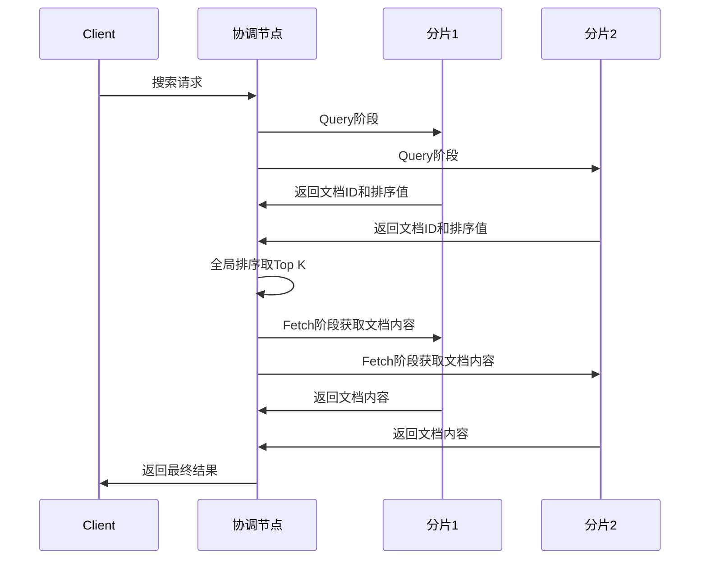

# ElasticSearch 核心原理深度解析

## 🎯 学习目标
- 深入理解ElasticSearch的核心架构和工作原理
- 掌握倒排索引、分片、副本等核心概念
- 理解ES的搜索机制和性能优化策略
- 能够清晰解释ES与传统数据库的区别

## 📖 核心概念深度解析

### 1. 什么是ElasticSearch？

**定义**：ElasticSearch是一个基于Apache Lucene的分布式搜索和分析引擎，专为处理大规模数据的实时搜索而设计。

**核心特点**：
- **分布式**：天然支持集群部署和水平扩展
- **实时**：准实时搜索，秒级延迟
- **全文搜索**：支持复杂的全文检索和分析
- **RESTful API**：通过HTTP API进行操作
- **无模式**：动态映射，灵活的数据结构

### 2. ES与传统数据库的对比

| 特性 | ElasticSearch | 传统关系数据库(MySQL) |
|------|---------------|----------------------|
| **数据模型** | 文档型(JSON) | 关系型(表、行、列) |
| **查询方式** | DSL查询 | SQL查询 |
| **索引机制** | 倒排索引 | B+树索引 |
| **擅长场景** | 全文搜索、分析 | 事务处理、精确查询 |
| **数据一致性** | 最终一致性 | 强一致性 |
| **扩展性** | 水平扩展友好 | 垂直扩展为主 |

## 核心原理Deepseek讲解：
Elasticsearch (ES) 的核心原理可以归结为以下几个关键点，理解了这些就抓住了它的精髓：

**核心支柱：**

1.  **分布式文档存储：**
    *   **基本单位是 JSON 文档：** ES 存储和索引的是结构化的 JSON 文档。每个文档属于一个特定的“类型”（在 7.x 后逐渐弱化）和一个“索引”。
    *   **索引是逻辑容器：** 索引类似于关系型数据库中的“数据库”，是相关文档的集合。它定义了文档的结构（映射/Mapping）和设置（如分片数、副本数）。
    *   **分片是物理单元：**
        *   一个索引被水平拆分成多个**分片**。这是 ES 实现分布式和可扩展性的基石。
        *   分片是独立、完整的 Lucene 索引实例，可以分布在集群的不同节点上。
        *   数据写入时，根据文档 ID 的哈希值路由到某个主分片。
        *   分片数量在索引创建时指定，之后**不能更改**（需要 Reindex）。
    *   **副本提供高可用和性能：**
        *   每个主分片可以有零个或多个**副本分片**。
        *   副本是主分片的完整拷贝。
        *   作用：
            *   **高可用：** 主分片故障时，副本分片可提升为主分片。
            *   **负载均衡：** 读请求（搜索、获取）可以被负载均衡到所有分片（主分片或副本分片），提升查询吞吐量。
            *   **数据冗余：** 防止数据丢失。

2.  **倒排索引：**
    *   这是 ES (底层基于 Apache Lucene) 实现**快速全文搜索**的核心数据结构。
    *   **传统索引 vs 倒排索引：**
        *   传统索引（如书籍目录）：文档 -> 包含的关键词。
        *   倒排索引：关键词 -> 包含该关键词的文档列表。
    *   **构建过程：**
        *   **分词：** 将文档中的文本字段内容切分成独立的词条（Token）。
        *   **标准化：** 对词条进行规范化处理（如转小写、移除标点、词干提取、同义词转换等），使其更易于匹配。
        *   **建立映射：** 为每个标准化的词条记录它出现在哪些文档中、出现的频率、在文档中的位置等信息。
    *   **搜索过程：**
        *   将用户输入的查询字符串进行同样的分词和标准化处理。
        *   在倒排索引中查找这些标准化词条对应的文档列表。
        *   根据查询条件（如布尔逻辑：AND/OR/NOT）组合这些文档列表。
        *   根据相关性算法（如 TF-IDF, BM25）对匹配的文档进行评分排序。

3.  **近实时搜索：**
    *   ES 写入的数据**不是立即可查**的（但比传统数据库快得多），而是“近实时”（NRT）。
    *   **核心机制：**
        *   **内存缓冲区：** 新写入的文档首先被添加到内存中的一个缓冲区。
        *   **Refresh：**
            *   每隔一段时间（默认 1 秒，可配置），或者缓冲区达到一定大小，会触发一次 `refresh` 操作。
            *   `refresh` 会：
                *   将内存缓冲区中的文档清空。
                *   创建一个新的、不可变的 Lucene **段**（Segment）写入文件系统缓存（**不是直接刷盘！**）。
                *   这个新的段被打开，使其包含的文档变得**可被搜索**。
            *   **关键点：** `refresh` 操作代价相对较低（不涉及磁盘 I/O，只写文件系统缓存），是实现 NRT 的关键。1 秒的延迟通常可以接受。
        *   **Translog：**
            *   为了保证在 `refresh` 间隔内（或节点故障时）数据不丢失，所有写入操作在进入内存缓冲区的同时，也会被追加写入到一个持久化的**事务日志**中。
            *   只有 Translog 成功落盘，写入操作才会返回成功给客户端。
            *   在节点重启或故障恢复时，会重放 Translog 来恢复最后一次 `refresh` 之后的数据。
        *   **Flush：**
            *   定期（默认 30 分钟，或 Translog 大小达到阈值）或需要时触发。
            *   执行真正的磁盘写入：将内存中所有在文件系统缓存中的段（由之前的 `refresh` 生成）**持久化（fsync）到磁盘**。
            *   创建一个新的 Translog（旧的可以被删除）。
            *   这是一个相对昂贵的操作。
        *   **Segment Merge：**
            *   随着 `refresh` 不断产生新的小段，后台会异步地将多个小段合并成更大的段。
            *   合并过程会：
                *   物理删除标记为已删除的文档。
                *   优化索引结构，提高查询效率。
                *   减少需要打开的文件句柄数量。
            *   合并是 I/O 和 CPU 密集型的操作，可能会影响性能，但至关重要。

4.  **集群、节点和角色：**
    *   **集群：** 由一个或多个节点组成，共同持有整个数据（所有索引的分片），并提供联合的索引和搜索能力。集群有唯一的名称标识。
    *   **节点：** 集群中的一个运行中的 ES 实例。每个节点都有唯一名称，启动时可以加入指定名称的集群。
    *   **节点角色：** 节点可以扮演不同的角色（可以组合）：
        *   **主节点：** 负责集群层面的轻量级操作（创建/删除索引、跟踪节点状态、决定分片分配）。集群必须有一个稳定的主节点。通常建议配置 3 个专用主节点（非数据节点）以保证高可用。
        *   **数据节点：** 存储分片数据（主分片或副本分片），执行与数据相关的操作（CRUD、搜索、聚合）。这是承载负载的主要节点类型。
        *   **协调节点：** 处理客户端的请求。接收请求，将请求路由到相关数据节点，收集结果并返回给客户端。任何节点默认都可以是协调节点。在大型集群中，可以设置专用协调节点来分担负载。
        *   **Ingest 节点：** 在索引文档之前执行预处理管道（Pipeline），进行数据转换（如解析、丰富、清洗）。
        *   **机器学习节点：** 运行机器学习任务。
    *   **分片分配：** ES 会自动将索引的分片（主分片和副本）分配到集群中的不同数据节点上，确保：
        *   同一个主分片和它的副本不会分配到同一个节点上（保证冗余）。
        *   分片尽可能均匀分布，实现负载均衡和高可用。

**总结：ES 的强大之处在于如何结合这些核心原理：**

1.  **分布式：** 通过分片（Sharding）将数据水平拆分并分布到多个节点，实现了**海量数据存储**和**横向扩展**能力。通过副本（Replication）实现了**高可用性**和**读取负载均衡**。
2.  **高性能搜索：** 底层依赖 **Lucene 的倒排索引**提供极其**快速的全文检索**能力。
3.  **近实时性：** 通过**内存缓冲区 + Refresh (文件系统缓存) + Translog** 机制，在**写入吞吐量**、**搜索延迟**（近实时）和**数据可靠性**之间取得了极佳的平衡。
4.  **高可用与容错：** 通过**分片副本机制**、**主节点选举**、**Translog 数据保护**以及**自动分片重分配**等机制，保证集群在节点故障时仍能提供服务。
5.  **易扩展性：** 只需添加新节点，ES 会自动将分片重新均衡到新节点上，实现近乎线性的扩展能力（存储和计算）。

**简单比喻：**

想象一个巨大的图书馆（集群）：

*   **索引 = 一类书的集合**（如“所有科幻小说”）。
*   **分片 = 将这类书分散存放在多个不同的书架（节点）上**（如书架A放A-G作者的书，书架B放H-M的书...）。每个书架（分片）上都有完整的部分书籍。
*   **副本 = 重要书籍的备份**。每个主书架旁边都有一个备用书架（副本），存放着主书架上书籍的完整拷贝。主书架坏了，备用书架顶上。
*   **倒排索引 = 超级目录卡**。不仅按书名，还按书中的每个关键词（分词、标准化后）记录了所有包含这个词的书名和位置。
*   **近实时 = 新书上架流程**。新书不会立刻放进主书架，而是先放在入口处的临时推车（内存缓冲区）里。图书管理员每隔一小会儿（refresh）就把推车里的书整理成一小摞（新段），放到主书架旁边的临时展示台（文件系统缓存）上，这时读者就能查到了。同时，管理员会记录下新书清单（Translog）。每隔一段时间或者清单太长，管理员才真正把这摞书塞进主书架（flush）。
*   **协调节点 = 前台咨询员**。读者（客户端）来问问题，咨询员负责去各个相关书架（数据节点）找答案，汇总后告诉读者。

理解这些核心原理，就能更好地使用 ES、诊断问题、进行性能调优和容量规划。

## 🏗️ ES 核心架构

### 1. 集群架构组件

#### 1.1 节点类型详解

```yaml
# Master节点配置
node.master: true
node.data: false
node.ingest: false

# Data节点配置  
node.master: false
node.data: true
node.ingest: false

# Ingest节点配置
node.master: false
node.data: false
node.ingest: true
```

**Master节点**：
- 集群管理：创建/删除索引、分配分片
- 节点管理：监控节点状态、处理节点加入/离开
- 元数据管理：维护集群状态信息

**Data节点**：
- 数据存储：存储实际的文档数据
- 查询执行：执行搜索和聚合操作
- 索引操作：处理文档的增删改操作

**Ingest节点**：
- 数据预处理：在索引前对文档进行处理
- 管道处理：执行各种处理器(processor)

#### 1.2 集群发现机制

```yaml
# 集群发现配置
cluster.name: my-es-cluster
discovery.zen.minimum_master_nodes: 2
discovery.zen.ping.unicast.hosts: ["192.168.1.1", "192.168.1.2", "192.168.1.3"]
```

**选主过程**：
1. 节点启动时广播自己的信息
2. 收集其他节点的响应信息
3. 根据节点ID排序，选择最小ID的合格节点
4. 达到最小主节点数量要求后确定Master

### 2. 索引结构

#### 2.1 逻辑结构
```
集群(Cluster)
  └── 索引(Index)
      └── 类型(Type) [已废弃]
          └── 文档(Document)
              └── 字段(Field)
```

#### 2.2 物理结构
```
索引(Index)
  └── 分片(Shard)
      ├── 主分片(Primary Shard)
      └── 副本分片(Replica Shard)
          └── 段(Segment)
              └── 倒排索引(Inverted Index)
```

## 🔍 倒排索引深度解析

### 1. 什么是倒排索引？

**定义**：倒排索引是将文档中的词汇映射到包含该词汇的文档列表的数据结构。

**正排索引 vs 倒排索引**：
```
文档数据：
Doc1: "The quick brown fox"
Doc2: "The fox is quick"
Doc3: "Brown fox jumps"

正排索引（文档 -> 词汇）：
Doc1 -> [The, quick, brown, fox]
Doc2 -> [The, fox, is, quick]  
Doc3 -> [Brown, fox, jumps]

倒排索引（词汇 -> 文档）：
the    -> [Doc1, Doc2]
quick  -> [Doc1, Doc2]
brown  -> [Doc1, Doc3]
fox    -> [Doc1, Doc2, Doc3]
is     -> [Doc2]
jumps  -> [Doc3]
```

### 2. 倒排索引结构详解

#### 2.1 词典(Term Dictionary)
```
存储所有不重复的词条，通常使用FST(Finite State Transducer)数据结构
优点：内存效率高，支持前缀查询
```

#### 2.2 倒排列表(Posting List)
```
每个词条对应一个倒排列表，包含：
- 文档ID (Document ID)
- 词频 (Term Frequency)  
- 位置信息 (Position)
- 偏移量 (Offset)
```

**具体示例**：
```json
{
  "quick": {
    "doc_freq": 2,
    "postings": [
      {
        "doc_id": 1,
        "tf": 1,
        "positions": [1],
        "start_offset": 4,
        "end_offset": 9
      },
      {
        "doc_id": 2, 
        "tf": 1,
        "positions": [3],
        "start_offset": 11,
        "end_offset": 16
      }
    ]
  }
}
```

### 3. 分词(Analysis)过程

#### 3.1 分析器组成
```java
// 分析器 = 字符过滤器 + 分词器 + 词条过滤器
GET /_analyze
{
  "analyzer": "standard",
  "text": "The Quick Brown Fox!"
}

响应：
{
  "tokens": [
    {"token": "the", "start_offset": 0, "end_offset": 3},
    {"token": "quick", "start_offset": 4, "end_offset": 9},
    {"token": "brown", "start_offset": 10, "end_offset": 15},
    {"token": "fox", "start_offset": 16, "end_offset": 19}
  ]
}
```

#### 3.2 常用分析器
```json
// 标准分析器
"settings": {
  "analysis": {
    "analyzer": {
      "my_standard": {
        "type": "standard",
        "stopwords": ["the", "is", "a"]
      }
    }
  }
}

// 中文分析器(IK)
"settings": {
  "analysis": {
    "analyzer": {
      "my_ik": {
        "type": "ik_max_word"
      }
    }
  }
}
```

## 🎯 分片机制深度解析

### 1. 分片基本概念

**主分片(Primary Shard)**：
- 索引数据的原始副本
- 数量在索引创建时确定，后续不可更改
- 负责处理写入和读取请求

**副本分片(Replica Shard)**：
- 主分片的完整拷贝
- 数量可以动态调整
- 提供读取性能和数据冗余

### 2. 分片分配策略

#### 2.1 路由算法
```javascript
// 文档路由到分片的计算公式
shard_num = hash(routing_value) % number_of_primary_shards

// 默认routing_value是文档ID
// 可以自定义routing参数
PUT my_index/_doc/1?routing=user123
{
  "user": "user123",
  "message": "Hello World"
}
```

#### 2.2 分片分配原则
```yaml
# 集群级别分片分配设置
cluster.routing.allocation.enable: all
cluster.routing.allocation.node_concurrent_recoveries: 2
cluster.routing.allocation.cluster_concurrent_rebalance: 2

# 避免同一分片的主副本分配到同一节点
cluster.routing.allocation.same_shard.host: false
```

### 3. 分片大小规划

#### 3.1 分片数量规划
```
经验法则：
- 分片大小：20-40GB
- 每个节点分片数：20-25个分片/GB堆内存  
- 总分片数 = 主分片数 × (1 + 副本数)

示例计算：
数据量：1TB
分片大小：30GB
主分片数：1TB / 30GB ≈ 34个
副本数：1
总分片数：34 × 2 = 68个
```

#### 3.2 分片配置示例
```json
// 创建索引时指定分片配置
PUT /my_index
{
  "settings": {
    "number_of_shards": 5,
    "number_of_replicas": 1,
    "index.routing.allocation.total_shards_per_node": 2
  },
  "mappings": {
    "properties": {
      "title": {"type": "text"},
      "content": {"type": "text"},
      "created_date": {"type": "date"}
    }
  }
}
```

## 🔎 搜索执行原理

### 1. 搜索类型

#### 1.1 Query Then Fetch（默认）


**详细流程**：
1. **Query阶段**：各分片执行查询，返回排序后的文档ID
2. **协调节点合并**：对所有分片结果进行全局排序
3. **Fetch阶段**：获取最终需要的文档完整内容

#### 1.2 DFS Query Then Fetch
```json
// 使用DFS搜索类型
GET /my_index/_search?search_type=dfs_query_then_fetch
{
  "query": {
    "match": {
      "content": "elasticsearch"
    }
  }
}
```

**区别**：增加了预查询阶段计算全局词频统计，提高相关性得分准确性

### 2. 相关性评分算法

#### 2.1 TF-IDF算法（ES 5.x之前）
```
score(q,d) = coord(q,d) × queryNorm(q) × ∑(tf(t,d) × idf(t)² × boost(t) × norm(t,d))

其中：
- tf(t,d): 词频，词条在文档中出现的频率
- idf(t): 逆文档频率，log(总文档数/包含词条的文档数)
- coord(q,d): 协调因子，查询词条命中率
- queryNorm(q): 查询标准化因子
- boost(t): 词条权重提升
- norm(t,d): 字段长度标准化
```

#### 2.2 BM25算法（ES 5.x之后默认）
```
score(D,Q) = ∑(IDF(qi) × tf(qi,D) × (k1+1) / (tf(qi,D) + k1×(1-b+b×|D|/avgdl)))

参数说明：
- k1: 控制词频饱和度，默认1.2
- b: 控制字段长度对评分的影响，默认0.75
- |D|: 文档长度
- avgdl: 平均文档长度
```

**BM25配置**：
```json
PUT /my_index
{
  "settings": {
    "similarity": {
      "my_bm25": {
        "type": "BM25",
        "k1": 1.5,
        "b": 0.8
      }
    }
  },
  "mappings": {
    "properties": {
      "content": {
        "type": "text",
        "similarity": "my_bm25"
      }
    }
  }
}
```

## 📊 段合并机制

### 1. 段(Segment)基本概念

**段的特点**：
- 不可变性：一旦创建不能修改
- 独立索引：每个段都是独立的倒排索引
- 合并策略：定期合并小段为大段

### 2. 段合并策略

#### 2.1 TieredMergePolicy（默认）
```json
PUT /my_index/_settings
{
  "index.merge.policy.max_merge_at_once": 10,
  "index.merge.policy.segments_per_tier": 10,
  "index.merge.policy.max_merged_segment": "5gb"
}
```

**参数说明**：
- `max_merge_at_once`: 一次最多合并的段数
- `segments_per_tier`: 每层允许的段数
- `max_merged_segment`: 合并后段的最大大小

#### 2.2 强制合并
```json
// 强制合并为1个段（注意：仅在不再写入时使用）
POST /my_index/_forcemerge?max_num_segments=1

// 删除已删除文档的段
POST /my_index/_forcemerge?only_expunge_deletes=true
```

## ⚡ 性能优化策略

### 1. 索引优化

#### 1.1 批量写入优化
```java
// 使用Bulk API批量写入
BulkRequest bulkRequest = new BulkRequest();
for (int i = 0; i < 1000; i++) {
    IndexRequest indexRequest = new IndexRequest("my_index")
        .id(String.valueOf(i))
        .source("field1", "value" + i);
    bulkRequest.add(indexRequest);
}

// 设置批量写入参数
bulkRequest.timeout("2m");
bulkRequest.setRefreshPolicy(WriteRequest.RefreshPolicy.WAIT_UNTIL);
```

#### 1.2 刷新策略优化
```json
// 调整刷新间隔
PUT /my_index/_settings
{
  "refresh_interval": "30s"
}

// 写入密集期间关闭自动刷新
PUT /my_index/_settings
{
  "refresh_interval": -1
}

// 手动刷新
POST /my_index/_refresh
```

### 2. 查询优化

#### 2.1 查询缓存利用
```json
// 启用请求缓存
GET /my_index/_search?request_cache=true
{
  "size": 0,
  "aggs": {
    "popular_terms": {
      "terms": {
        "field": "category.keyword"
      }
    }
  }
}
```

#### 2.2 过滤器优化
```json
// 使用filter context（不计算相关性得分，可缓存）
{
  "query": {
    "bool": {
      "must": [
        {"match": {"title": "elasticsearch"}}
      ],
      "filter": [
        {"term": {"status": "published"}},
        {"range": {"publish_date": {"gte": "2023-01-01"}}}
      ]
    }
  }
}
```

### 3. 集群优化

#### 3.1 JVM配置
```bash
# jvm.options配置
-Xms4g
-Xmx4g
-XX:+UseG1GC
-XX:G1HeapRegionSize=16m
-XX:+UnlockExperimentalVMOptions
-XX:+UseG1GC
```

#### 3.2 系统配置
```bash
# 系统限制配置
echo "elasticsearch soft nofile 65536" >> /etc/security/limits.conf
echo "elasticsearch hard nofile 65536" >> /etc/security/limits.conf

# 内存映射限制
echo "vm.max_map_count=262144" >> /etc/sysctl.conf
sysctl -p
```

## 🎓 面试要点总结

### 1. 核心概念回答模板

**倒排索引原理**：
- 倒排索引将文档中的每个词汇映射到包含该词汇的文档列表
- 相比传统数据库的B+树索引，倒排索引专门优化了全文搜索场景
- 包含词典和倒排列表两部分，支持快速的词汇查找和文档检索

**分片机制**：
- 主分片存储原始数据，副本分片提供冗余和读取性能
- 通过路由算法将文档分配到具体分片，实现数据分布
- 分片数量需要在创建索引时确定，影响集群的扩展性和性能

### 2. 与MySQL对比的标准答案

**ES优势**：
1. **全文搜索**：基于倒排索引，擅长模糊匹配和相关性排序
2. **分布式架构**：天然支持水平扩展和高并发
3. **实时分析**：支持复杂聚合分析，适合日志分析场景
4. **灵活schema**：支持动态映射，适应变化的数据结构

**MySQL优势**：
1. **精确查询**：基于B+树索引，擅长精确匹配和范围查询
2. **事务支持**：ACID特性，保证数据强一致性
3. **关系查询**：支持复杂的关联查询和外键约束
4. **成熟生态**：工具链完善，运维经验丰富

**使用场景**：
- ES：搜索引擎、日志分析、实时监控、推荐系统
- MySQL：交易系统、用户管理、订单处理、关系数据存储

### 3. 常见面试追问

**Q: ES为什么搜索快？**
A: 1）倒排索引直接定位包含关键词的文档；2）分布式并行搜索；3）内存缓存机制；4）段的不可变性支持高效缓存。

**Q: 如何保证ES写入性能？**
A: 1）批量写入减少网络开销；2）调整刷新间隔；3）合理设置副本数；4）使用SSD存储；5）优化段合并策略。

**Q: ES如何处理数据一致性？**
A: ES采用最终一致性模型，通过版本控制、乐观锁、读写分离等机制保证数据一致性。

---

**🎯 学习检验**：能否清晰解释倒排索引的工作原理和ES的分片机制？能否准确对比ES与MySQL的适用场景？ 