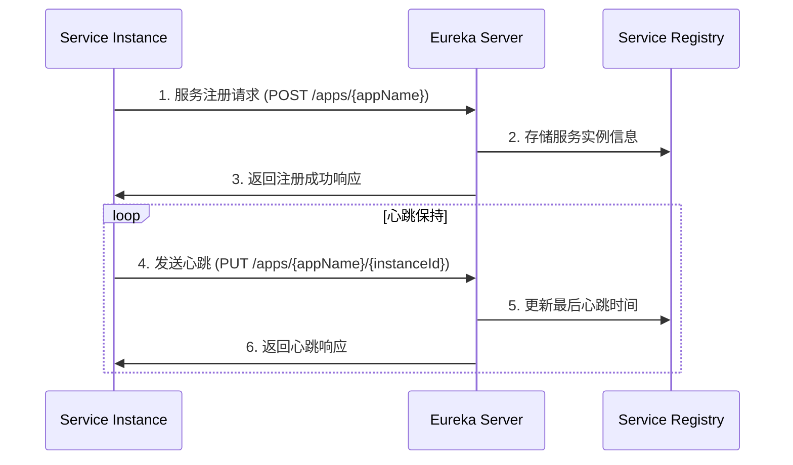
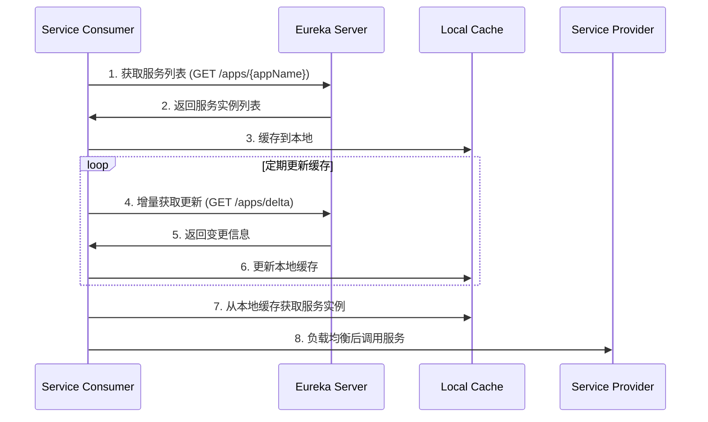
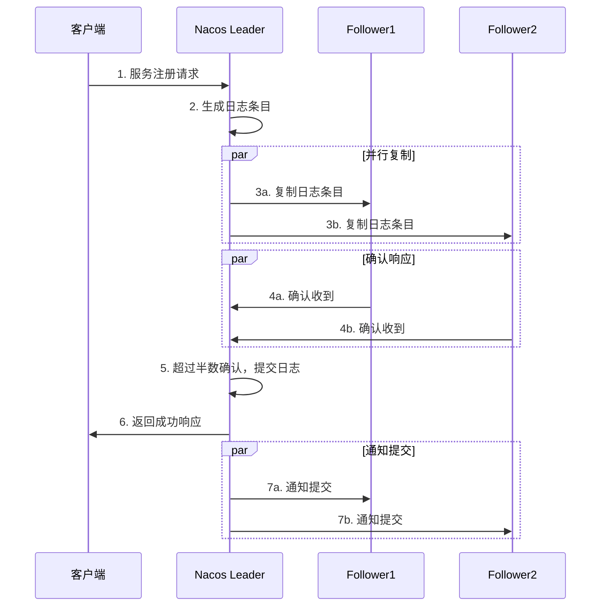

# 服务注册与发现原理深度解析

## 🎯 学习目标
- 深入理解服务注册与发现的工作原理
- 掌握Eureka的核心机制和容错策略
- 对比不同注册中心的优缺点
- 能够准确描述服务发现的完整流程

## 📖 核心概念

### 1. 什么是服务注册与发现？

**服务注册**：服务启动时，将自己的信息（服务名、IP地址、端口等）注册到注册中心

**服务发现**：客户端从注册中心获取服务提供者的信息，然后进行远程调用

**核心价值**：
- 解耦服务提供者和消费者
- 支持服务的动态扩容缩容
- 提供负载均衡和故障转移能力

### 2. 服务注册与发现架构模式

#### 2.1 客户端发现模式（Eureka采用）
```
服务实例 -> 注册中心 (注册)
客户端 -> 注册中心 (查询) -> 客户端缓存
客户端 -> 服务实例 (直接调用)
```

**优点**：
- 客户端可以自主选择负载均衡策略
- 性能好，减少中间环节
- 网络拓扑相对简单

**缺点**：
- 客户端逻辑复杂
- 客户端与注册中心耦合

#### 2.2 服务端发现模式（K8s Service采用）
```
服务实例 -> 注册中心 (注册)
客户端 -> 负载均衡器 -> 注册中心 (查询)
负载均衡器 -> 服务实例 (代理调用)
```

**优点**：
- 客户端逻辑简单
- 负载均衡集中管理
- 服务发现逻辑对客户端透明

**缺点**：
- 负载均衡器可能成为瓶颈
- 网络跳数增加

## 🔧 Eureka 深度剖析

### 1. Eureka 架构组件

#### 1.1 Eureka Server（注册中心）
```java
@SpringBootApplication
@EnableEurekaServer
public class EurekaServerApplication {
    public static void main(String[] args) {
        SpringApplication.run(EurekaServerApplication.class, args);
    }
}
```

**核心功能**：
- 接收服务注册请求
- 维护服务实例注册表
- 提供服务发现接口
- 服务实例健康检查
- 集群数据同步

#### 1.2 Eureka Client（服务提供者/消费者）
```java
@SpringBootApplication
@EnableEurekaClient
public class ServiceProviderApplication {
    public static void main(String[] args) {
        SpringApplication.run(ServiceProviderApplication.class, args);
    }
}
```

**核心功能**：
- 服务注册到Eureka Server
- 定期发送心跳保持注册
- 从Eureka Server获取注册信息
- 缓存注册信息到本地

### 2. Eureka 完整工作流程

#### 2.1 服务注册流程



**详细步骤**：

1. **服务启动注册**
```java
// 服务实例信息
InstanceInfo instanceInfo = InstanceInfo.Builder.newBuilder()
    .setAppName("user-service")
    .setInstanceId("user-service-001")
    .setHostName("192.168.1.100")
    .setPort(8080)
    .setVIPAddress("user-service")
    .setStatus(InstanceStatus.UP)
    .build();

// 发送注册请求到Eureka Server
eurekaClient.registerInstance(instanceInfo);
```

2. **定期发送心跳**
```java
// 默认每30秒发送一次心跳
@Scheduled(fixedRate = 30000)
public void sendHeartbeat() {
    eurekaClient.sendHeartbeat(appName, instanceId);
}
```

#### 2.2 服务发现流程



**详细实现**：

1. **获取服务实例列表**
```java
// 从Eureka Server获取服务列表
Applications applications = eurekaClient.getApplications();
Application userService = applications.getRegisteredApplications("USER-SERVICE");
List<InstanceInfo> instances = userService.getInstances();

// 过滤健康的实例
List<InstanceInfo> healthyInstances = instances.stream()
    .filter(instance -> instance.getStatus() == InstanceStatus.UP)
    .collect(Collectors.toList());
```

2. **负载均衡选择实例**
```java
// 轮询负载均衡
public class RoundRobinLoadBalancer {
    private AtomicInteger  = new AtomicInteger(0);
    
    public InstanceInfo choose(List<InstanceInfo> instances) {
        if (instances.isEmpty()) {
            return null;
        }
        int index = counter.getAndIncrement() % instances.size();
        return instances.get(index);
    }
}
```

### 3. Eureka 核心配置参数

#### 3.1 Server端配置
```yaml
eureka:
  server:
    # 关闭自我保护模式（生产环境建议开启）
    enable-self-preservation: false
    # 清理无效节点的时间间隔，默认60秒
    eviction-interval-timer-in-ms: 60000
    # 期望收到的心跳数阈值，低于此值触发自我保护
    renewal-percent-threshold: 0.85
  instance:
    # 服务器主机名
    hostname: eureka-server
```

#### 3.2 Client端配置
```yaml
eureka:
  client:
    # 是否向注册中心注册自己
    register-with-eureka: true
    # 是否从注册中心获取服务列表
    fetch-registry: true
    # 注册中心地址
    service-url:
      defaultZone: http://localhost:8761/eureka/
    # 从注册中心拉取服务列表的间隔，默认30秒
    registry-fetch-interval-seconds: 30
  instance:
    # 心跳间隔，默认30秒
    lease-renewal-interval-in-seconds: 30
    # 服务失效时间，默认90秒
    lease-expiration-duration-in-seconds: 90
    # 实例ID
    instance-id: ${spring.application.name}:${server.port}
```

### 4. Eureka 容错机制

#### 4.1 服务下线延迟问题及处理

**问题场景**：A调用B，如果B某个实例下线，而A的本地缓存还没有更新，调用的时候负载均衡策略正好选中了这个下线的服务。

**这种情况确实会出现，原因如下**：

1. **多级缓存延迟**：Eureka有三级缓存，数据同步有延迟
2. **客户端缓存**：客户端本地缓存默认30秒更新一次
3. **服务下线流程**：实例下线 → Server感知 → 缓存更新 → 客户端获取

**延迟时间分析**：
```
服务下线 → Eureka Server感知（最多90秒）
→ Server缓存更新（最多30秒）  
→ 客户端拉取更新（最多30秒）
总计：最长可能延迟150秒
```

**Eureka的处理机制**：

1. **客户端重试机制**
```java
@Component
public class ServiceCallHandler {
    
    @Retryable(
        value = {ConnectException.class, SocketTimeoutException.class},
        maxAttempts = 3,
        backoff = @Backoff(delay = 1000, multiplier = 2)
    )
    public String callService(String serviceName, String path) {
        List<ServiceInstance> instances = getAvailableInstances(serviceName);
        
        for (ServiceInstance instance : instances) {
            try {
                String url = "http://" + instance.getHost() + ":" + instance.getPort() + path;
                return restTemplate.getForObject(url, String.class);
            } catch (Exception e) {
                log.warn("调用实例{}失败，尝试下一个实例", instance.getInstanceId(), e);
                // 标记实例为不可用（本地临时标记）
                markInstanceDown(instance);
                continue;
            }
        }
        throw new ServiceUnavailableException("所有实例都不可用");
    }
}
```

2. **快速故障检测**
```java
// Ribbon的健康检查
@Component
public class HealthCheckHandler {
    
    // 客户端主动检查实例健康状态
    public boolean isInstanceHealthy(ServiceInstance instance) {
        try {
            String healthUrl = "http://" + instance.getHost() + ":" 
                             + instance.getPort() + "/actuator/health";
            ResponseEntity<String> response = restTemplate.getForEntity(healthUrl, String.class);
            return response.getStatusCode().is2xxSuccessful();
        } catch (Exception e) {
            return false;
        }
    }
}
```

3. **客户端熔断降级**
```java
@Component
public class CircuitBreakerService {
    
    @HystrixCommand(fallbackMethod = "fallbackMethod")
    public String callServiceWithCircuitBreaker(String serviceName) {
        // 服务调用逻辑
        return callRemoteService(serviceName);
    }
    
    public String fallbackMethod(String serviceName) {
        return "服务暂时不可用，请稍后重试";
    }
}
```

#### 4.2 自我保护机制

**触发条件**：当Eureka Server在短时间内丢失过多客户端时

**保护措施**：
- 不再删除服务实例信息
- 仍然能够接受新的注册信息
- 仍然能够提供查询服务

**实现原理**：
```java
// 自我保护判断逻辑
public boolean isLeaseExpirationEnabled() {
    if (!isSelfPreservationModeEnabled()) {
        return true;
    }
    
    // 计算期望的心跳数
    int expectedNumberOfRenews = getExpectedNumberOfClientsSendingRenews();
    int threshold = (int) (expectedNumberOfRenews * serverConfig.getRenewalPercentThreshold());
    
    // 如果实际心跳数低于阈值，开启自我保护
    return getNumOfRenewsInLastMin() > threshold;
}
```

#### 4.2 缓存机制

**三级缓存架构**：
1. **readOnlyCacheMap**：只读缓存，定期更新
2. **readWriteCacheMap**：读写缓存，实时更新
3. **registry**：实际注册表

**缓存更新流程**：
```java
// 获取服务列表的缓存逻辑
public Applications getApplications() {
    // 先从只读缓存获取
    Applications apps = readOnlyCacheMap.get(ALL_APPS);
    if (apps != null) {
        return apps;
    }
    
    // 再从读写缓存获取
    apps = readWriteCacheMap.get(ALL_APPS);
    if (apps != null) {
        // 更新只读缓存
        readOnlyCacheMap.put(ALL_APPS, apps);
        return apps;
    }
    
    // 最后从注册表获取
    apps = getApplicationsFromRegistry();
    readWriteCacheMap.put(ALL_APPS, apps);
    readOnlyCacheMap.put(ALL_APPS, apps);
    return apps;
}
```

#### 4.3 减少服务下线延迟的优化策略

**生产环境优化配置**：

1. **缩短缓存更新间隔**
```yaml
eureka:
  server:
    # 缩短只读缓存更新时间（默认30秒）
    response-cache-update-interval-ms: 5000
    # 关闭只读缓存（实时性要求高的场景）
    use-read-only-response-cache: false
  
  client:
    # 缩短客户端拉取间隔（默认30秒）
    registry-fetch-interval-seconds: 5
    # 缩短心跳间隔（默认30秒）
    lease-renewal-interval-in-seconds: 10
    # 缩短服务失效时间（默认90秒）
    lease-expiration-duration-in-seconds: 30
```

2. **主动健康检查**
```java
@Component
public class ProactiveHealthChecker {
    
    @Scheduled(fixedRate = 5000) // 每5秒检查一次
    public void checkInstanceHealth() {
        List<ServiceInstance> instances = discoveryClient.getInstances("user-service");
        
        instances.parallelStream().forEach(instance -> {
            if (!isHealthy(instance)) {
                // 主动从本地缓存移除不健康实例
                removeFromLocalCache(instance);
                log.warn("实例{}健康检查失败，已从本地缓存移除", instance.getInstanceId());
            }
        });
    }
    
    private boolean isHealthy(ServiceInstance instance) {
        try {
            String healthUrl = buildHealthCheckUrl(instance);
            ResponseEntity<String> response = restTemplate.getForEntity(
                healthUrl, String.class);
            return response.getStatusCode().is2xxSuccessful();
        } catch (Exception e) {
            return false;
        }
    }
}
```

3. **智能重试与故障转移**
```java
@Component
public class IntelligentRetryHandler {
    
    // 实例健康状态本地缓存
    private final Map<String, Boolean> instanceHealthCache = new ConcurrentHashMap<>();
    
    public <T> T callWithIntelligentRetry(String serviceName, 
                                         Function<ServiceInstance, T> caller) {
        List<ServiceInstance> healthyInstances = getHealthyInstances(serviceName);
        
        for (ServiceInstance instance : healthyInstances) {
            try {
                T result = caller.apply(instance);
                // 调用成功，标记实例为健康
                markInstanceHealthy(instance);
                return result;
            } catch (Exception e) {
                // 调用失败，标记实例为不健康
                markInstanceUnhealthy(instance);
                log.warn("调用实例{}失败: {}", instance.getInstanceId(), e.getMessage());
                
                // 如果是连接类异常，立即尝试下一个实例
                if (isConnectionException(e)) {
                    continue;
                }
            }
        }
        
        throw new ServiceUnavailableException("所有实例调用失败");
    }
    
    private List<ServiceInstance> getHealthyInstances(String serviceName) {
        return discoveryClient.getInstances(serviceName)
            .stream()
            .filter(instance -> instanceHealthCache.getOrDefault(
                instance.getInstanceId(), true))
            .collect(Collectors.toList());
    }
}
```

## 🆚 主流注册中心对比

### 1. Eureka vs Nacos vs Consul

| 特性 | Eureka | Nacos | Consul |
|------|--------|-------|--------|
| **一致性协议** | AP | CP + AP | CP |
| **健康检查** | 客户端心跳 | 多种方式 | 多种方式 |
| **负载均衡** | 客户端 | 客户端 | 服务端 |
| **多数据中心** | 支持 | 支持 | 支持 |
| **跨语言** | Java为主 | 多语言 | 多语言 |
| **Spring Cloud集成** | 原生支持 | 很好 | 良好 |

### 2. CAP理论视角分析

#### Eureka (AP)
- **可用性优先**：即使网络分区也能提供服务
- **最终一致性**：各节点数据最终会同步
- **适用场景**：对可用性要求高的场景

#### Nacos (CP + AP可选)
- **强一致性模式**：确保数据一致性
- **可用性模式**：类似Eureka的AP模式  
- **灵活配置**：可根据需求选择模式

**Nacos CP模式强一致性实现原理**：

1. **Raft协议保证一致性**
```java
// Nacos使用Raft协议实现强一致性
public class RaftConsistencyService {
    
    // Leader选举机制
    public void electLeader() {
        // 1. 候选者发起投票请求
        // 2. 获得大多数节点支持成为Leader
        // 3. Leader负责接收所有写请求
        if (getCurrentTerm() < candidateTerm && !hasVotedInCurrentTerm()) {
            vote(candidateId);
        }
    }
    
    // 日志复制机制
    public boolean replicateLog(LogEntry entry) {
        // 1. Leader接收写请求，生成日志条目
        // 2. 并行向所有Follower发送日志
        // 3. 收到大多数节点确认后提交
        int successCount = 0;
        for (Peer peer : peers) {
            if (peer.replicateEntry(entry)) {
                successCount++;
            }
        }
        
        // 超过半数确认才提交
        return successCount > peers.size() / 2;
    }
}
```

2. **数据一致性保证流程**


3. **网络分区处理**
```java
// 脑裂预防机制
public class SplitBrainPrevention {
    
    public boolean canProcessWrite() {
        int aliveNodes = getAliveNodesCount();
        int totalNodes = getTotalNodesCount();
        
        // 只有当存活节点超过半数时才能处理写请求
        return aliveNodes > totalNodes / 2;
    }
    
    // 网络分区恢复后的数据同步
    public void syncAfterPartitionRecover() {
        // 1. 比较各节点的日志
        // 2. 以Leader的日志为准进行同步
        // 3. 回滚不一致的数据
        for (Peer peer : peers) {
            syncLogWithPeer(peer);
        }
    }
}
```

4. **CP模式的权衡**
- ✅ **优势**：
  - 数据强一致性，不会出现脏读
  - 服务注册信息实时同步
  - 适合对数据准确性要求高的场景

- ❌ **劣势**：
  - Leader选举期间服务不可用
  - 网络分区可能导致服务中断
  - 写性能相对较低（需要大多数节点确认）

5. **配置示例**
```yaml
# Nacos配置文件
nacos:
  core:
    # 选择CP模式（默认AP模式）
    protocol:
      type: raft
      raft:
        # 选举超时时间
        election-timeout: 5000
        # 心跳间隔
        heartbeat-interval: 1000
```

#### Consul (CP)
- **强一致性**：使用Raft协议保证一致性
- **可能不可用**：Leader选举期间服务不可用
- **适用场景**：对数据一致性要求严格的场景

## 🚀 最佳实践

### 1. 服务注册最佳实践

#### 健康检查配置
```java
@Component
public class CustomHealthIndicator implements HealthIndicator {
    @Override
    public Health health() {
        // 自定义健康检查逻辑
        if (checkDatabaseConnection() && checkRedisConnection()) {
            return Health.up()
                .withDetail("database", "connected")
                .withDetail("redis", "connected")
                .build();
        } else {
            return Health.down()
                .withDetail("error", "External dependency failed")
                .build();
        }
    }
}
```

#### 优雅停机
```java
@PreDestroy
public void destroy() {
    // 优雅停机：先从注册中心下线，再停止服务
    eurekaClient.shutdown();
    
    // 等待一段时间让客户端更新缓存
    try {
        Thread.sleep(30000);
    } catch (InterruptedException e) {
        Thread.currentThread().interrupt();
    }
}
```

### 2. 服务发现最佳实践

#### 客户端缓存策略
```java
@Component
public class ServiceDiscoveryCache {
    private final LoadingCache<String, List<ServiceInstance>> cache;
    
    public ServiceDiscoveryCache() {
        this.cache = Caffeine.newBuilder()
            .maximumSize(1000)
            .expireAfterWrite(30, TimeUnit.SECONDS)
            .refreshAfterWrite(10, TimeUnit.SECONDS)
            .build(this::loadServiceInstances);
    }
    
    private List<ServiceInstance> loadServiceInstances(String serviceName) {
        return discoveryClient.getInstances(serviceName);
    }
}
```

#### 负载均衡与容错
```java
@Component
public class ResilientServiceCaller {
    
    @Retryable(value = {Exception.class}, maxAttempts = 3)
    public String callService(String serviceName, String path) {
        List<ServiceInstance> instances = getHealthyInstances(serviceName);
        
        for (ServiceInstance instance : instances) {
            try {
                return restTemplate.getForObject(
                    buildUrl(instance, path), String.class);
            } catch (Exception e) {
                log.warn("Failed to call instance: {}", instance.getUri(), e);
                // 尝试下一个实例
            }
        }
        
        throw new ServiceUnavailableException("No healthy instance available");
    }
}
```

## 🎓 面试要点总结

### 标准回答模板：服务注册发现流程

**服务注册流程**：
1. 服务启动时，读取配置信息（服务名、IP、端口等）
2. 向Eureka Server发送注册请求，包含服务实例信息
3. Eureka Server将服务信息存储在内存注册表中
4. 服务定期（默认30秒）向Eureka Server发送心跳保活
5. 如果心跳超时（默认90秒），Eureka Server会删除该实例

**服务发现流程**：
1. 客户端向Eureka Server发送查询请求
2. Eureka Server返回服务实例列表
3. 客户端将实例列表缓存到本地（默认30秒更新一次）
4. 客户端使用负载均衡算法选择一个实例
5. 直接调用选中的服务实例

### 关键技术点

1. **心跳机制**：服务每30秒发送心跳，90秒无心跳则剔除
2. **自我保护**：网络故障时不轻易剔除服务，保证可用性
3. **三级缓存**：提高查询性能，但会有数据延迟
4. **客户端负载均衡**：Ribbon实现轮询、随机等策略

### 常见面试追问

**Q: Eureka如何处理网络分区？**
A: 通过自我保护机制，当心跳失败率超过阈值时，暂停剔除服务实例，保证AP（高可用）。

**Q: 为什么选择Eureka而不是Zookeeper？**
A: Eureka采用AP模式，注重可用性；Zookeeper采用CP模式，注重一致性。微服务场景下，服务可用性比数据一致性更重要。

**Q: 如果服务B下线了，但服务A的本地缓存还没更新，这时调用会怎样？**
A: 这种情况确实会发生，因为Eureka有多级缓存延迟。解决方案：
1. 客户端重试机制：调用失败后自动重试其他实例
2. 健康检查：主动检测实例状态并更新本地缓存
3. 熔断降级：使用Hystrix等工具提供降级方案
4. 优化配置：缩短缓存更新间隔，减少延迟时间

**Q: Nacos的CP模式是如何保证强一致性的？**
A: Nacos使用Raft协议实现强一致性：
1. Leader选举：只有一个Leader处理写请求
2. 日志复制：Leader将操作日志复制到大多数Follower
3. 提交确认：超过半数节点确认后才提交事务
4. 脑裂预防：网络分区时，只有大多数节点的分区才能提供服务

**Q: 如何解决Eureka的数据延迟问题？**
A: 1）缩短缓存更新间隔；2）使用健康检查；3）客户端实现重试机制；4）考虑升级到Nacos等新一代注册中心。

---

**🎯 学习检验**：能否流畅地描述服务注册发现的完整流程，包括关键参数和容错机制？ 